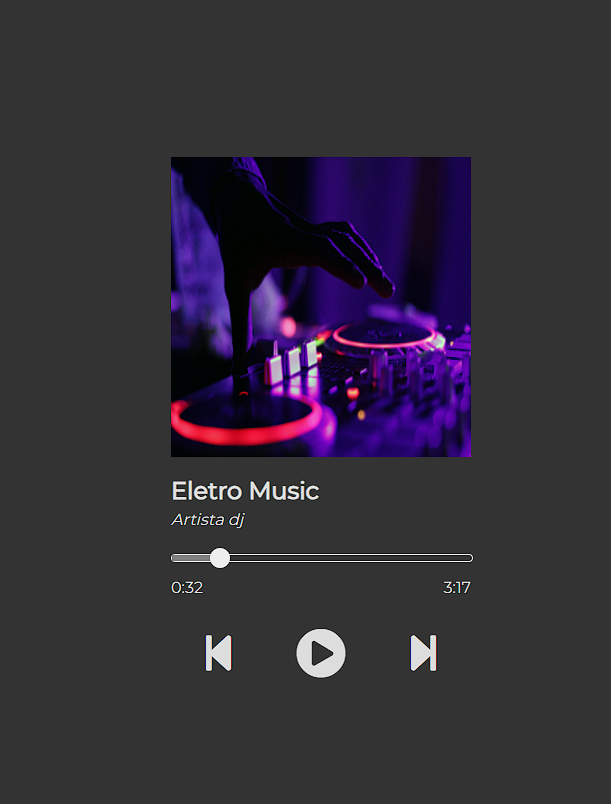

# Music-Player
Pequeno projeto Front end  de um Music player

### Aplicativo da Web para reprodutor de música

Este é um aplicativo simples de reprodutor de música web que permite reproduzir músicas de uma lista predefinida. Você pode executar esta aplicação em um navegador da web para ouvir músicas. Aqui estão as instruções sobre como executar a aplicação:

Como executar
Baixe todos os arquivos necessários para sua máquina, incluindo o arquivo HTML ( index.html), o arquivo JavaScript ( script.js), o arquivo CSS ( style.css), e todas as imagens e músicas relacionadas no código.

-se de que você tenha uma conexão com a internet ativa, pois o aplicativo utiliza fontes e ícones da web.

Abra o arquivo index.htmlem um navegador da web compatível com HTML5, como Google Chrome, Mozilla Firefox ou Safari.

A aplicação será fornecida e você verá a interface do player de música.

Funcionalidades
A aplicação permite reproduzir músicas da lista predefinida no JavaScript.
Você pode ver o nome da música, o artista e a duração no topo da interface.
Há uma barra de progresso que mostra o progresso da música e o ritmo decorrido.
Você pode pausar e retomar a reprodução usando os botões "Play" e "Pause".
Você pode avançar para a próxima música e voltar para a música anterior usando as setas correspondentes.
Lista de Músicas
A lista de músicas é definida no arquivo JavaScript ( script.js) como uma matriz de objetos. Cada objeto representa uma música com os seguintes campos:




titulo: O título da música.
artista: O nome do artista.
source: O caminho do arquivo de áudio da música.
img: O caminho da imagem da capa do álbum.
Você pode adicionar mais músicas à lista definindo novos objetos com esses campos.

```
let musicas = [
    {titulo:'Guitar solo', artista:'Artista 1', source:'musicas/ll Never Know - TrackTribe.mp3', img:'imagens/daniel-schludi-mbGxz7pt0jM-unsplash.jpg'},
    {titulo:'Eletro Music', artista:'Artista dj', source:'musicas/Is This Really Happening_ - TrackTribe (1).mp3', img:'imagens/marcela-laskoski-YrtFlrLo2DQ-unsplash.jpg'},
    {titulo:'Música piano', artista:'John Green', source:'musicas/A Brand New Start - TrackTribe (1).mp3', img:'imagens/piano.jpg'}
];
```

### Personalização
Você pode personalizar a aparência do aplicativo ajustando o arquivo CSS ( style.css). O CSS atual define a aparência básica da interface do player de música, mas você pode modificá-lo para atender às suas preferências de design.

Lembre-se de que esta é uma aplicação simples e pode ser expandida e aprimorada com recursos adicionais, como playlists personalizadas, controles de volume e muito mais, de acordo com suas necessidades.

Aproveite a música!

### Nota: certifique-se de que todas as imagens e músicas relacionadas no código estejam presentes em seus vários diretórios ou atualize os caminhos conforme necessário para que a aplicação funcione corretamente.
